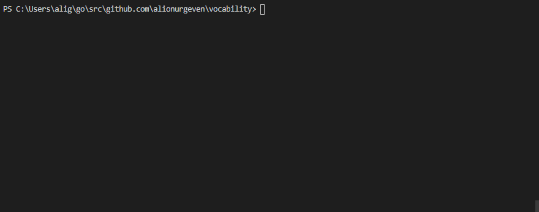

# vocability
This is a exercise for those who want to the improve their vocabulary by simply having a great time!

Get a 10 question quiz of words from the Webster's Unabridged English Dictionary. Enrich your vocabulary.

# Exercising

Simply follow the steps below to start exercising:

`go build`

After the build
## Windows

`./vocability.exe`

## Unix based systems

`./vocability`

# TO DO List
- [x] Create the game loop
- [x] Create the words database with their meanings
- [x] Create random question generator
- [ ] Create UI for the exercise
